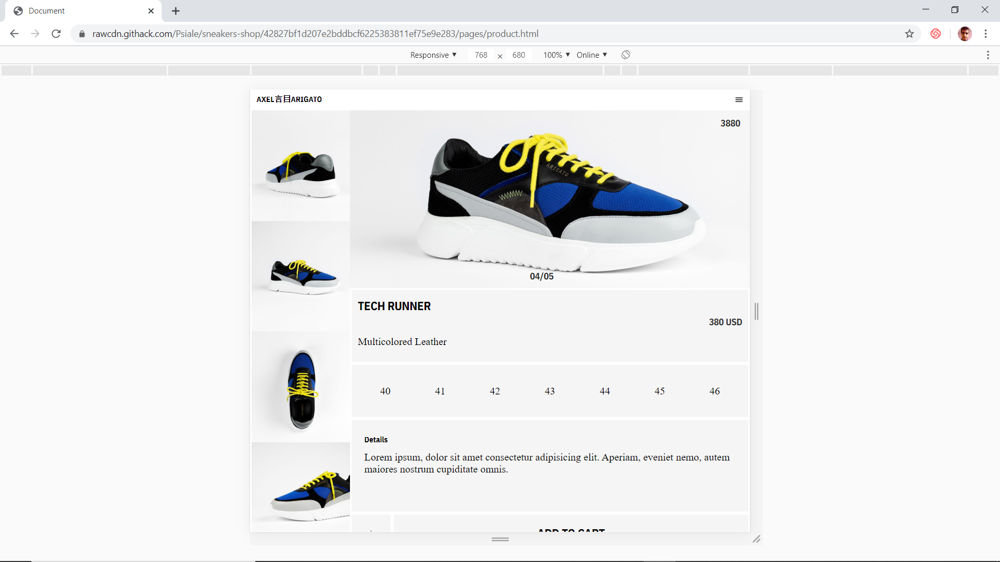
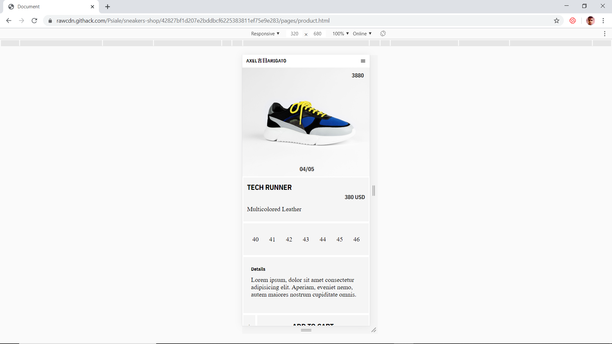

# Sneakers-shop
### A recreation of a sneakers shop web design.

* [The purpouse of this webpage](#The-purpouse-of-this-webpage)
* [Built With](#built-with)
* [Credits](#contact)
* [Live Demo](#Live-Version)
 

# The purpouse of this webpage:
To recreate the web design by Axel Arigato and build a fully responsive webpage using Flexbox and SCSS. 
 

# Built With
HTML5/CSS3
SCSS

# Credits
### [Psiale](https://www.linkedin.com/in/alexis-sanchez-dev/)
### [Axel Arigato](https://www.behance.net/gallery/80392909/AXEL-ARIGATO-Website)

 

# Live Version
[Live Demo](https://rawcdn.githack.com/Psiale/sneakers-shop/42827bf1d207e2bddbcf6225383811ef75e9e283/pages/main.html#)

### Main Page

### Catalogue Page

### Product Page

 

